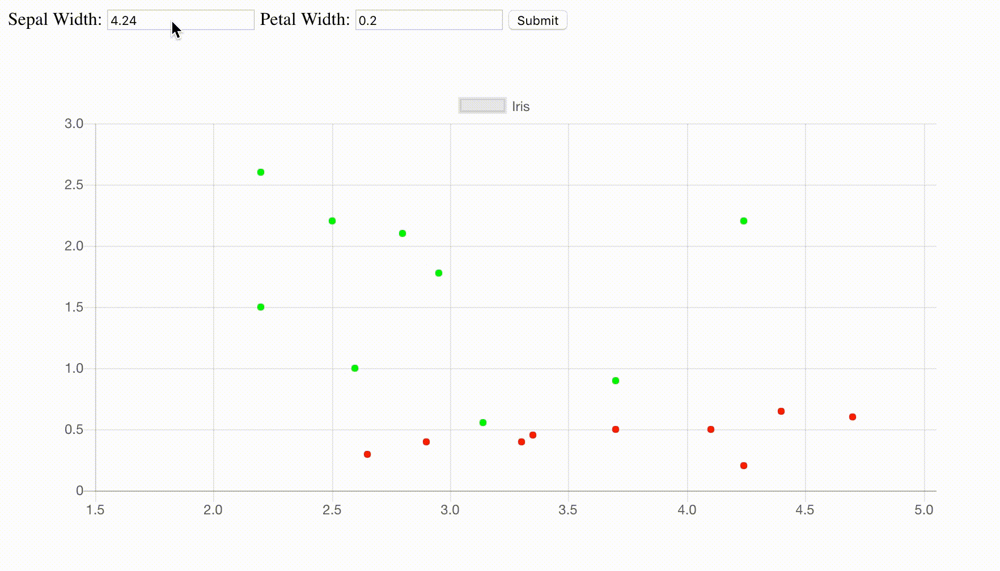
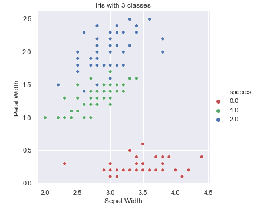
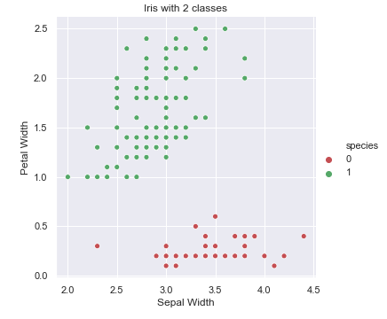

# Live Classification using TensorFlow.JS on Iris dataset
A tensorflow.js web application to perform classification and prediction on the Iris dataset using TensorFlow Keras API in JavaScript.

## Live Demo

  

## Dataset

The dataset used is Iris and the two linearly separable species (Virginica and Versicolor) are combined together to convert it into a binary classification problem. The original iris dataset looks like this:

 

  

 

As we can see the two classes 1 and 2 are linearly inseparable and we combine them together for this tutorial. After we combine the classes the new graph would look like this:

 

  

 

Also, note that only 2 (sepal width, petal width) out of the 4 (sepal width, petal width, sepal length, petal length) features have been selected for classification.

## Classification Model in tf.js

Classification is performed using this dataset in tensorflow.js and the application takes user input in the form of `Sepal Width` and `Petal Width` through the browser and the model classifies the examples into one of the two categories created above and displays them in different colors.

## Graph

The library used to plot the graph in JS is [chart.js](https://www.chartjs.org/). Though I have no experience in JavaScript, this library was intuitive and simple to use. Visit the [documentation](https://www.chartjs.org/docs/latest/) of the website to see what all you can do with __chart.js__.

## Dependencies

- tensorflowjs - 0.6.7
- chart.js

## How to use this repo

For now, I haven't created a web server to host this application and therefore, the best and simplest way would be to clone this repository and then running `tfjs.html` in your browser!

#### Contributing

This is my first JavaScript encounter and this application may be a total turndown for JS developers out there. So I am calling out JS developers to collaborate and make this into a proper web application. I have tons of ideas for ML web applications but no JS experience to move forward with them. Raise an issue if you would like to collaborate or contribute!

#### Resources

- [TensorFlow.js tutorials](https://js.tensorflow.org/tutorials/how-to-get-started.html)
- [TensorFlow.js getting started](https://js.tensorflow.org/#getting-started)
- [Pythonprogramming.net tutorial](https://pythonprogramming.net/deep-learning-browser-introduction-tensorflowjs/)
- [Chart.js documentation](https://www.chartjs.org/docs/latest/)
- A lot of stackoverflow on [tensorflow.js](https://stackoverflow.com/search?q=tensorflowjs) and [chart.js](https://stackoverflow.com/search?q=chartjs)
